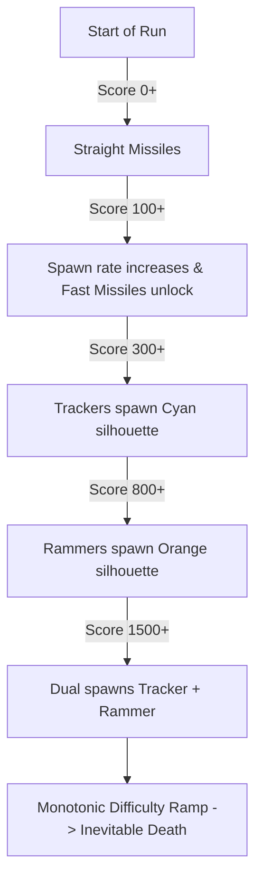

# tooClose - Game Design and Architecture

tooClose is a high-octane, vertical scrolling 2D arcade dodge-and-shoot 'em up for mobile platforms. The core identity of the game revolves around risk-reward gameplay (Near Misses), where players are incentivized to fly as close to lethal threats as possible to rack up massive scores and multiplier combos.

---

## 1. Core Gameplay Loop

1. **Dodge and Survive:** Pilot your aircraft through an increasingly dense, procedurally spawned barrage of missiles and enemy fighters.
2. **Embrace Danger (Near Miss):** Deliberately brush past incoming threats to trigger the Near Miss mechanic, multiplying your score.
3. **Collect and Trigger:** Gather stars (the primary currency) and deploy powerful active items (Shields, Blaze, Slow-Mo, Zoom) via a double-tap interface.
4. **Upgrade and Expand:** Use collected stars in the Hangar/Garage to unlock new aircraft and upgrade their stats (Speed, Handling, Armor).

---

## 2. Main Gameplay Mechanics

### Player Control Options
The player's aircraft continuously flies forward at a base speed (determined by the selected plane's stats). The player controls only the direction of travel using one of two modes:
* **Virtual Joystick:** Free 360-degree rotation using an on-screen stick, with a small dead zone (less than 0.3 magnitude) to prevent accidental turns.
* **Touch Mode (Tap-to-turn):** Tap the left or right side of the screen to orient the aircraft laterally.
* **Visual Juice (3D Tilt):** Visual flair is added through a cosmetic 3D tilt. The sprite rolls on its Y-axis (up to 20 degrees) depending on horizontal movement inputs, adding weight and perspective.

### The Near Miss (Too Close!) System
This is the central hook of the game. Attached to the player is a NearMissDetector (a wider trigger collider than the plane's actual hitbox).
* **Trigger:** If a missile passes inside this outer radius without colliding with the ship's core hitbox, a Near Miss is registered.
* **Rewards:** Players gain score points (50 multiplied by the current combo).
* **Combo Timer:** The combo multiplier increases with successive near-misses. The player has a tight window of 1.5 seconds to chain another near-miss before the combo resets to zero.
* **Sensory Feedback:**
  * Dynamic yellow text reading "TOO CLOSE! xN (+score)" pops onto the screen, scaling up before flying toward the HUD score.
  * A brief visual lens distortion punch (-0.5) that smoothly decays.
  * Haptic feedback (vibration) and a slight game-feel slowdown.

### Power-Ups (Double-Tap Activation)
Power-ups are picked up during a run and stored in the HUD slot, activated by double-tapping the screen:
1. **Shield:** Absorbs all damage for 10 seconds.
2. **Blaze (Fire Ring):** A protective ring rotates at 360 degrees/second around the player, destroying any missile it touches for 10 seconds.
3. **Slow-Mo:** Slows all missile movement and rotation speed by 50% for 8 seconds without slowing down the player or global time scale.
4. **Zoom:** Orthographic camera size expands from 10 to 15 for 8 seconds, providing a wider field of view to anticipate threats. The terrain generation automatically expands its generation distance (maxViewDist from 20 to 35) to prevent visual gaps.
5. **EMP Bomb:** Destabilizes and redirects all on-screen threats. Upon activation, it triggers a screen shake (amplitude 5, duration 0.5s), initiates device vibration, and sends a growing visual shockwave (up to a radius of 35 units, fading from transparent cyan to fully transparent) from the aircraft. All active Missiles, Rammers, and Trackers on the screen are forced to lock onto a random threat instead of the player, causing them to collide and destroy each other.

---

## 3. Threats and Enemy Behavior

The game features four main threats, appearing procedurally as the score rises:

### 1. Straight Missiles
Standard projectiles that travel in straight trajectories, serving as simple obstacles.

### 2. Fast Missiles
These projectiles travel and turn much faster than standard ones. The probability of spawning a fast missile increases as the score climbs:
fastMissileChance = Clamp(score / fastMissileMultiplier, 0, 0.7)

### 3. Trackers (Cyan Silhouette)
* **Unlocked at:** 300 score points or higher.
* **Behavior:** Travel relatively slowly (1.8 units/second base, scaling up to 4.5 units/second over the run). They perform micro-corrections using Perlin noise to create erratic, snake-like flight paths.
* **Proximity Stress:** If a Tracker gets within 8.0 units of the player, it triggers an ambient camera shake (up to 0.35 amplitude) and plays a tension-building audio loop that rises in pitch (0.8 to 1.4) and volume (0.0 to 0.45).

### 4. Rammers (Orange Silhouette)
* **Unlocked at:** 800 score points or higher.
* **Behavior:** A heavy, state-machine driven enemy. It approaches, aligns with the player, flashes bright red during a warning period (Telegraph phase), and then charges forward at high velocity (18 units/second).
* **The Second Wind Mechanic:** If the Rammer misses its target, it slows down, turns around, and charges a second time with a shorter warning window and higher speed (24 units/second). If it fails the second time, it exits the screen.
* **Crash Dynamics:** If a Rammer collides with a missile, it triggers a dramatic slowdown (0.3x for 0.15s) and a large camera shake (1.5).

---

## 4. Systems Architecture

* **Continuous Density Spawning (MissileSpawner):** There are no breaks or rounds. The spawn delay drops by 0.05s every 100 score points until it hits a minimum threshold of 1.0s. Batch sizes scale up dynamically, and an anti-repetition mechanism prevents missiles from spawning from the same location back-to-back.
* **Procedural Infinite Terrain (ChunkManager):** The game maps a grid of 20x20 visual decoration chunks. Chunks are pooled and recycled dynamically based on their distance from the camera proxy.
* **Aircraft Upgrade System (PlaneUpgradeManager):** Players spend stars to level up three key stats:
  * **Speed:** Increases travel velocity (+0.5 units/second per level).
  * **Handling:** Tightens turn radius (+1.0 rotation speed per level).
  * **Armor:** Gives extra hit points (+1 hit point per level).
  * *Upgrade Cost Scale:* Costs grow exponentially: Cost = baseCost * costMultiplier^(level - 1).
* **Save State Management:** High scores, cumulative stars, unlocked aircraft, and individual plane upgrades are saved locally using PlayerPrefs.
