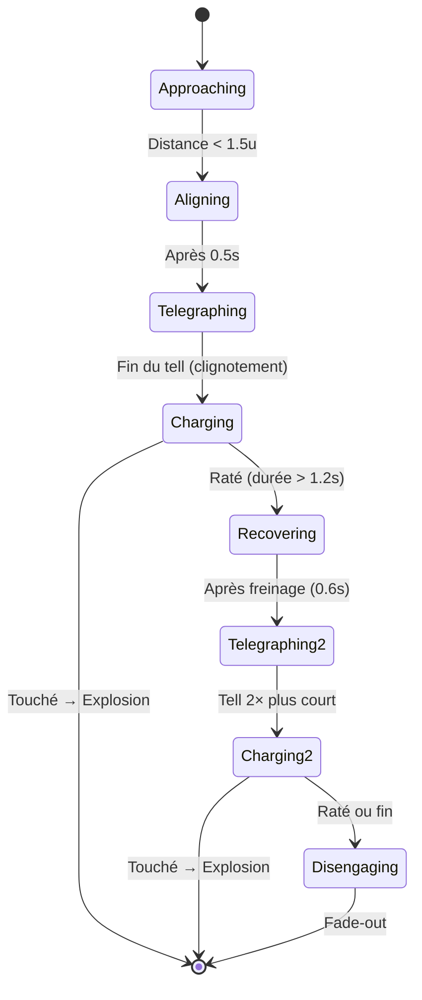
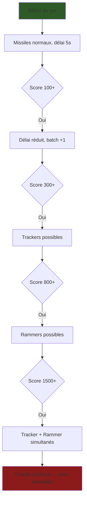

# TooClose — Game Design Document
### Physique & Gameplay

---

## 1. Vue d'ensemble

**Genre :** Endless runner aérien vertical (2D, portrait, mobile)
**Core loop :** Le joueur pilote un avion qui avance automatiquement vers le haut. Il esquive des missiles à tête chercheuse et des chasseurs ennemis tout en collectant des étoiles et des power-ups. La difficulté augmente de façon continue (courbe de densité) sans temps morts.

**Sensation cible :** Tension constante, frôlements à répétition, nervosité croissante — le joueur doit toujours être "trop proche" de quelque chose.

---

## 2. Mouvement du Joueur

### 2.1 Avance automatique

| Paramètre | Valeur par défaut | Source |
|---|---|---|
| Vitesse de base | `6.0` unités/s | [PlaneData.speed](file:///d:/Unity/Projects/tooClose/Assets/Scripts/PlaneData.cs#L6) |
| Direction | `transform.up` (avant local) | [PlayerMovement.cs L208](file:///d:/Unity/Projects/tooClose/Assets/Scripts/PlayerMovement.cs#L208) |

L'avion avance **automatiquement** dans sa direction locale `up` à chaque frame :
```
transform.position += transform.up * speed * Time.deltaTime
```
Le joueur ne contrôle pas la vitesse, seulement la **direction**.

### 2.2 Contrôle directionnel (Mode Joystick)

- **Input** : Joystick virtuel (stick gauche)
- **Mécanique** : Le joueur oriente le stick, l'avion **tourne progressivement** vers cette direction via `Mathf.LerpAngle`
- **Dead zone** : Magnitude du stick < `0.3` → pas de rotation
- **Vitesse de rotation** : `rotationSpeed` (défaut `5.0`), modifiable par les upgrades "Contrôle"

### 2.3 Inclinaison visuelle (Juice)

Un **tilt 3D** purement cosmétique est appliqué au sprite de l'avion selon l'input horizontal :
- Rotation sur l'axe Y (pas Z) → donne un effet de perspective
- Amplitude max : `maxTiltAngle = 20°`
- Vitesse : `tiltSpeed = 10f`
- En mode latéral : tilt à gauche si touch sur la moitié gauche de l'écran, à droite sinon

### 2.4 Points de vie et mort

| Stat | Valeur de base | Upgradeable |
|---|---|---|
| Points de vie | `1` (par défaut) | Oui, via "Blindage" |
| Fumée visuelle | S'active quand `life == 1` et que le joueur a plus d'1 PV max | — |

- **À 0 PV** → `DieProcess()` : freeze frame (0.25s), camera shake (amplitude 3.0), impact zoom (3.0 ortho), explosion, puis écran de mort.
- **Invincibilité post-revive** : 8 clignotements × 0.2s réel = ~1.6s d'immunité

---

## 3. Caméra

- **Système** : Cinemachine (`CinemachineCamera`) suivant un proxy (`CameraFollowProxy`)
- **Mode Dodging** : Le proxy est **exactement** sur la position du joueur chaque frame. Cinemachine assure le lissage visuel via ses propres réglages de Damping.
- **Taille ortho par défaut** : `normalLensSize = 10`
- **Camera Shake** : Via `CinemachineBasicMultiChannelPerlin`, piloté par [CameraShake.cs](file:///d:/Unity/Projects/tooClose/Assets/Scripts/CameraShake.cs) — utilisé pour les explosions, les near-misses, la proximité du Tracker, et la mort.

---

## 4. Missiles (Menace principale)

### 4.1 Comportement

Défini dans [MissileScript.cs](file:///d:/Unity/Projects/tooClose/Assets/Scripts/MissileScript.cs).

| Paramètre | Normal | Rapide |
|---|---|---|
| Vitesse | `5.0` | Plus élevée (config prefab) |
| Vitesse de rotation | `200°/s` | Plus élevée |
| Durée de vie | `5.0s` | `5.0s` |
| Apparition (score) | Toujours | Probabilité croissante avec le score |

**Homing** : Chaque frame, le missile calcule la direction vers le joueur et applique une rotation angulaire via `rb.angularVelocity` (cross product) + une vélocité linéaire constante vers l'avant (`transform.up * speed`).

**Fin de vie** : Après `duration` secondes → fade-out (0.75s) avec réduction de taille et d'opacité, puis destruction silencieuse (pas d'explosion).

### 4.2 Probabilité de missile rapide

```
fastMissileChance = Clamp(score / currentFastMissileMultiplier, 0, 0.7)
```

| Difficulté | Multiplicateur | Chance à score 1000 |
|---|---|---|
| Easy | `2000` | 50% |
| Hard | `1000` | 70% (plafond) |

### 4.3 Collisions du missile

| Cible | Résultat |
|---|---|
| Joueur (sans power-up) | Dégâts au joueur + explosion |
| Joueur (Shield ou Blaze) | Explosion du missile, joueur indemne |
| Autre missile | Les deux explosent |
| Blaze (zone de feu) | Missile détruit |
| Bullet (laser joueur) | Les deux détruits |
| Tracker (chasseur) | Les deux explosent |
| Rammer (chasseur) | Les deux explosent + slow-mo + shake fort |

---

## 5. Système de Spawn Continu (Courbe de Densité)

Géré par [MissileSpawner.cs](file:///d:/Unity/Projects/tooClose/Assets/Scripts/MissileSpawner.cs). **Pas de vagues, pas de pauses.**

### 5.1 Délai de spawn

```
currentSpawnDelay = max(minimumSpawnDelay, currentSpawnDelay - difficultyScaling)
```

| Paramètre | Easy | Hard |
|---|---|---|
| Délai initial | `5.0s` | `3.0s` |
| Délai minimum | `1.0s` | `1.0s` |
| Réduction par milestone | `0.05s` | `0.05s` |
| Max missiles par batch | `3` | `5` |
| Milestone de score | Tous les `100` points | Tous les `100` points |

### 5.2 Anti-répétition

Le système mémorise le dernier index de spawn (`lastSpawnIndex`) et force un index différent au spawn suivant pour éviter deux missiles consécutifs du même point.

### 5.3 Indicateurs hors-écran

Chaque missile génère un indicateur UI (`OffScreenIndicator`) attaché au Canvas qui suit la position du missile en dehors du champ de vision → flèche directionnelle vers la menace. Couleur rouge pour les missiles rapides, couleur par défaut pour les normaux.

---

## 6. Chasseurs (Ennemis dynamiques)

Deux archétypes introduits via la courbe de densité, avec des seuils de score :

### 6.1 Tracker — "Le bruit de fond stressant"

Défini dans [Tracker.cs](file:///d:/Unity/Projects/tooClose/Assets/Scripts/Tracker.cs).

| Seuil d'apparition | Score ≥ `300` |
|---|---|
| Vitesse de base | `1.8` unités/s |
| Scaling vitesse | `+0.003` par seconde de run |
| Vitesse max | `4.5` unités/s |
| Durée de vie | `12s` |

**Identité visuelle** : Silhouette fine, cyan électrique. Vol nerveux avec micro-corrections constantes (Perlin noise, amplitude `0.6`, fréquence `4.0`).

**Mécanique unique — Pression ambiante** :
- En dessous de `8.0` unités de distance → effets proportionnels à la proximité :
  - **Audio** : Son en boucle dont le volume (max `0.45`) et le pitch (0.8 → 1.4) augmentent
  - **Caméra** : Shake continu léger (max `0.35` d'amplitude) quand proximité > 30%
- **Le Tracker ne tue quasiment jamais directement** — il rend les missiles plus dangereux en réduisant la marge de manœuvre perçue du joueur

**Désengagement** : Après 12s → fade-out + fuite vers le haut-droit à `8` unités/s

**Progression intra-run** : Sa vitesse augmente de `0.003` par seconde de run → à 3 minutes, il avance à `~2.3` au lieu de `1.8`

**Score si éliminé** : `300 × scoreMultiplier`

---

### 6.2 Rammer — "Le second souffle"

Défini dans [Rammer.cs](file:///d:/Unity/Projects/tooClose/Assets/Scripts/Rammer.cs).

| Seuil d'apparition | Score ≥ `800` |
|---|---|
| Vitesse de charge 1 | `18` unités/s |
| Vitesse de charge 2 | `24` unités/s |
| Tell de base | `1.2s` |
| Tell minimum | `0.4s` |

**Identité visuelle** : Silhouette massive, anguleuse, rouge-orange. Stable et immobile pendant l'alignement.

**Comportement à 2 temps (machine à états)** :



**Tell visuel** : Clignotement alternant couleur originale ↔ rouge vif (`1f, 0.2f, 0.1f`), `4` flashs pendant la durée du tell.

**Le Second Souffle** : S'il rate la première charge, il **freine**, se **réaligne**, puis charge une **seconde fois** plus vite (24 vs 18) avec un tell **deux fois plus court**. Il ne rate jamais deux fois — après la seconde charge, il se désengage.

**Progression intra-run** : Le tell de base se réduit de `0.005s` par seconde de run → à 2 minutes, le tell passe de `1.2s` à `~0.6s`

**Moment signature** : Collision missile ↔ Rammer = **brief slow-mo** (0.3× pendant 0.15s réel) + camera shake fort (1.5) → feedback d'exploit

**Score si éliminé** : `500 × scoreMultiplier`

---

### 6.3 Spawn des chasseurs

| Paramètre | Easy | Hard |
|---|---|---|
| Probabilité de base/cycle | `5%` | `10%` |
| Augmentation par score | `+0.005%` par point | `+0.005%` par point |
| Probabilité max | `35%` | `35%` |
| Cooldown initial | `15s` | `10s` |
| Cooldown min | `5s` | `5s` |
| Réduction cooldown | `0.05s` par seconde de run | `0.05s` par seconde de run |
| Max simultanés | 1 (2 si score ≥ 1500) | 1 (2 si score ≥ 1500) |

**Choix du type** : Si les deux sont débloqués → 60% Tracker, 40% Rammer.

---

## 7. Power-Ups

Ramassés au sol via trigger (tag `PowerUp`). Stockés dans un slot HUD. Activés par **double-tap**.

### 7.1 Shield (Bouclier)

| Durée | `10s` (cumulable) |
|---|---|
| Effet | Absorbe tout impact (missile, ennemi, chasseur) sans dégât |
| Visuel | Objet enfant activé autour du joueur |

### 7.2 Blaze (Flammes)

| Durée | `10s` (cumulable) |
|---|---|
| Effet | Zone de destruction tournante autour du joueur — détruit les missiles au contact |
| Visuel | Objet enfant qui tourne à `360°/s` autour du joueur |
| Physique | Colliders enfants du `blazeEffectObject` scannés via `bounds.Intersects` |

### 7.3 SlowMo (Ralenti)

| Durée | `8s` (cumulable) |
|---|---|
| Effet | Multiplie la vitesse et rotation des missiles par `slowMoFactor = 0.5` |
| Important | N'affecte **pas** le `Time.timeScale` — seuls les missiles sont ralentis via `PlayerPowerUpManager.instance.isSlowMoActive` vérifié dans `MissileScript.FixedUpdate()` |

### 7.4 Zoom (Loupe)

| Durée | `8s` (cumulable) |
|---|---|
| Effet | La caméra dézoom de `10` à `15` en taille ortho → champ de vision élargi |
| Transition | Lerp rapide (×10/s) vers le zoom-out, lerp lent (×8/s) vers le retour |
| Camera shake | À l'activation : 0.3s à amplitude 3.0 |
| ChunkManager | `maxViewDist` passe de `20` à `35` pour éviter les trous de terrain |

---

## 8. Near Miss (Système "TOO CLOSE!")

Détecté par [NearMissDetector.cs](file:///d:/Unity/Projects/tooClose/Assets/Scripts/NearMissDetector.cs) — un `CircleCollider2D` (trigger) plus large que le collider du joueur.

### 8.1 Mécanique

Quand un missile entre dans la zone de near-miss **sans toucher** le joueur :

| Combo | Score gagné | Formule |
|---|---|---|
| ×1 | +50 | `50 × combo` |
| ×2 | +100 | |
| ×3 | +150 | |
| ×N | +50N | |

- **Leeway du combo** : `1.5s` — si aucun near-miss pendant 1.5s, le combo retombe à 0

### 8.2 Feedback

1. **Texte animé** : "TOO CLOSE! ×N\n+score" en jaune, pop avec scale sinusoïdal puis vol vers le compteur de score
2. **Post-processing** : Lens distortion punchée (`-0.5`) pendant 0.08s puis retour smooth
3. **Vibration** : `Handheld.Vibrate()` à chaque near miss
4. **Pulse score** : Le texte du score fait un pulse (×1.2) quand le texte near-miss arrive

---

## 9. Collectibles — Étoiles

Gérées par [PickUpStar.cs](file:///d:/Unity/Projects/tooClose/Assets/Scripts/PickUpStar.cs).

- **Rotation constante** : Tourne sur l'axe Z à `90°` par slerp
- **Ramassage** : Trigger → son → VFX particules (burst de 12, couleur `#F6D740`) → animation de vol vers le HUD (accélération quadratique) → +1 étoile
- **Spawn** : Via [SpawnObjects.cs](file:///d:/Unity/Projects/tooClose/Assets/Scripts/SpawnObjects.cs), hors champ de vision, avec anti-overlap (scan `Physics2D.OverlapCircleAll` rayon 0.8)

| Difficulté | Chance étoile | Intervalle de spawn |
|---|---|---|
| Easy | `85%` | `1.2s` |
| Hard | `50%` | `0.8s` |

---

## 10. Score

Le score augmente **automatiquement** : `+1 × scoreMultiplier` tous les `0.1s` (soit ~10 points/seconde de base).

Sources de score supplémentaires :
| Source | Points |
|---|---|
| Score automatique | `1 × multiplier` / 0.1s |
| Near miss | `50 × combo` |
| Ennemi détruit | `200 × multiplier` |
| Tracker éliminé | `300 × multiplier` |
| Rammer éliminé | `500 × multiplier` |

---

## 11. Système d'Avions

Défini par [PlaneData.cs](file:///d:/Unity/Projects/tooClose/Assets/Scripts/PlaneData.cs).

### 11.1 Stats de base par avion

Chaque avion a ses propres statistiques :
- `speed` — vitesse de défilement
- `rotationSpeed` — réactivité du virage
- `life` — PV de base
- `maxTiltAngle` / `tiltSpeed` — paramètres de juice spécifiques
- `maxSpeedLevel`, `maxHandlingLevel`, `maxArmorLevel` — plafonds d'upgrade

### 11.2 Upgrades (3 axes)

Géré par [PlaneUpgradeManager.cs](file:///d:/Unity/Projects/tooClose/Assets/Scripts/PlaneUpgradeManager.cs).

| Upgrade | Effet par niveau | Niveau max (défaut) |
|---|---|---|
| **Vitesse** | `+0.5` unités/s | `3` |
| **Contrôle** | `+1.0` rotation/s | `3` |
| **Blindage** | `+1` PV | `1` |

Formule de coût : `baseCost × costMultiplier^(level-1)`

Exemple (Vitesse, base 100, multi 1.3) :
- Niveau 2 : 100 ⭐
- Niveau 3 : 130 ⭐
- Niveau 4 : 169 ⭐

---

## 12. Terrain Procédural

Géré par [ChunkManager.cs](file:///d:/Unity/Projects/tooClose/Assets/Scripts/ChunkManager.cs).

- **Chunks de 20×20** : Instanciés aléatoirement depuis un pool de prefabs (`chunksAvailableEasy` / `chunksAvailableHard`)
- **Distance de vue** : `20` unités par défaut, `35` en mode Zoom
- **Recyclage** : Les chunks hors distance sont désactivés (`SetActive(false)`)
- **Coordonnées** : Dictionnaire `Vector2 → TerrainChunk2D`, indexé par position de grille
- **Aucune collision** : Le terrain est purement visuel (décor de fond)

---

## 13. Résumé de la boucle de difficulté



La difficulté est une **fonction monotone croissante du score** :
1. Le délai entre les spawns diminue
2. La taille des batches augmente
3. La proportion de missiles rapides augmente
4. Les chasseurs apparaissent avec un cooldown de plus en plus court
5. Le tell du Rammer se raccourcit
6. La vitesse du Tracker augmente

**Il n'y a pas de plafond de difficulté intentionnel** — le jeu est conçu pour que la mort soit inévitable, la question étant "combien de temps tu tiens".
